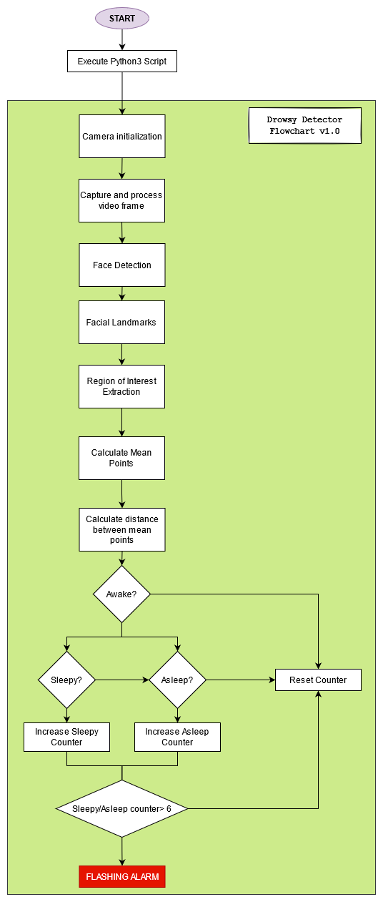

# Drowsiness Detection
One of the most important problems in computer vision is detecting objects in images without the needs for human intervention. Face detection is a type of concern in which we try to find human faces in a series of photos. Although human faces differ slightly, it is safe to say that certain characteristics are shared by all of them.

With that in mind, road accidents have always been a major contribution in the compilation of deaths and several injuries due to many factors. One of the leading factor is due to the feeling of drowsiness and/or the lack of sleep from the driver. In order to prevent such accident from occuring in the near future, many solutions come into play such as having proper rest before driving; drinking coffee to get that caffeine boost; similarly drinking any sugar heavy and energy intensive drinks; have another relative/friend to drive it for you and many more. However as this is based off of computer vision project, the proper approach to take care of our drivers, feeling all drowsy and weak, would be to have a drowsy detector system implemented in real-time.

Essentially this system will utilise feature points (landmarks) on a driver's face to determine whether the state of the eye is at an open/mid/close state. Due to the constraints and scope of this project, the only events capable of execution are to detect the drowsiness of the driver and alert it back to the driver in a flashing way.

# Project Scope
- Capture video and colour conversion from webcam.
- Detecting drowsiness from extracting key facial landmarks.
- Alert back to user with flashing and bright coloured texts.

# Functional Requirements
Dlib is used as a tool for detecting face landmarks in an image. What these 'landmarks' means is they are essentially just vector points on the face such as the mouth, eyebrows, the eyes and so on that help to distinguish the characteristic of what a face would look like and should have. For this prototype, the 68 landmarks model is used for a more thorough landmark scanning. There is another model respectively called the 5 landmarks model, which is also provided by dlib. The 5 landmarks model only scans for the corners of the eyes and the bottom of the nose. Whereas the 68 landmarks model identifies the following parts of the faces:

- Jaw (ear to ear)
- Nose
- Left and Right eyebrows
- Left and Right eyes
- Mouth

# Technical Requirements
- Python 3.8.5
- OpenCV-python 4.5.2.52
- Dlib 19.22.0
- Imutils 0.5.4
- Numpy 1.20.3

# System Architecture

# Testing
The following describes the hardware that have been fully tested and developed on.
- OS: Ubuntu Debian Linux 64-bit 20.04.2 LTS
- Memory: 8GB
- Processor: Intel® Core™ i5-5300U CPU
- Graphics: Mesa Intel® HD Graphics 5500
- Camera: In-built

### Future testing:
Hoping to be tested on a Raspberry Pi 3/4 with the Camera module and some other buzzer noises attached to the board.

# Result

1. `cd drowsyDetector` - After cloning, move directory
2. `pip install -r requirement.txt` - Get all the modules setup and installed locally accordingly with the versions listed.
3. `python3 drowsy.py` - Execute script

NOTE*: The `shape_predictor_68_face_landmarks.dat` may need to be downloaded separately and also specified in the path properly. To download the trained model, just head over to [This link](dlib.net/files/shape_predictor_68_face_landmarks.dat.bz2) and manually download and extract.